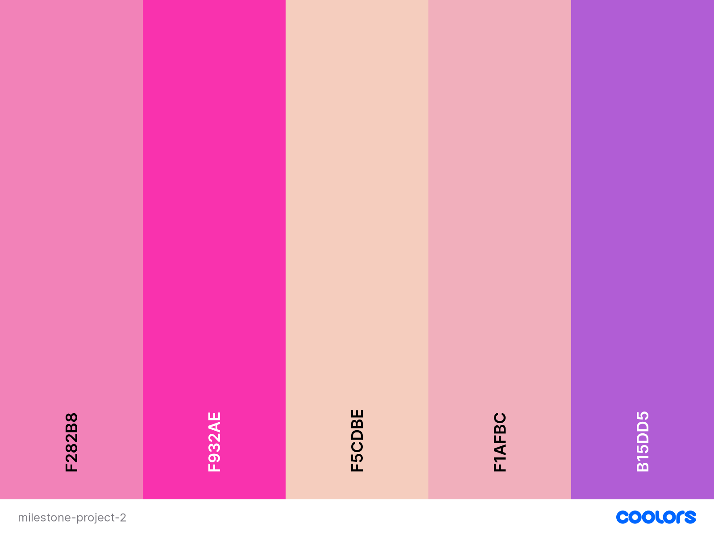
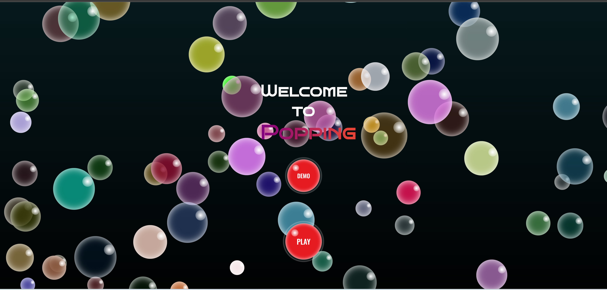
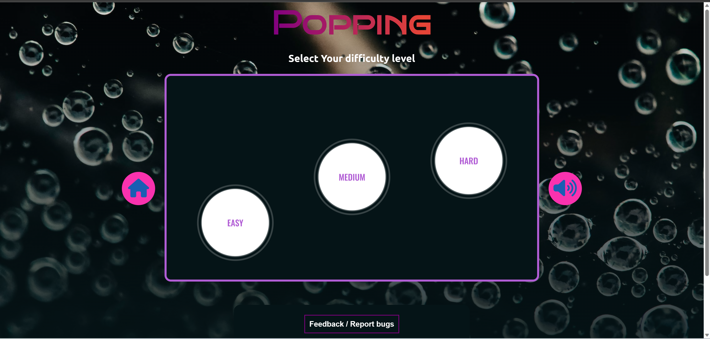
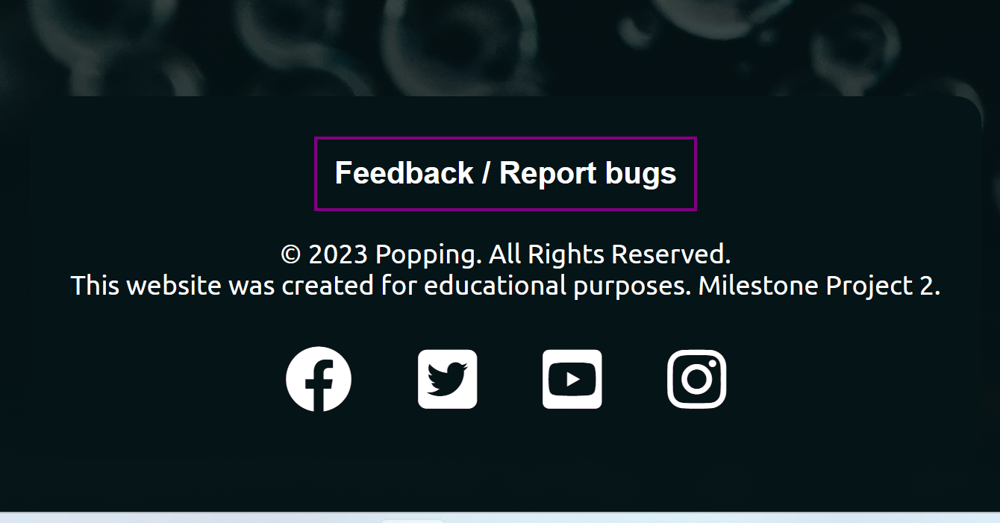
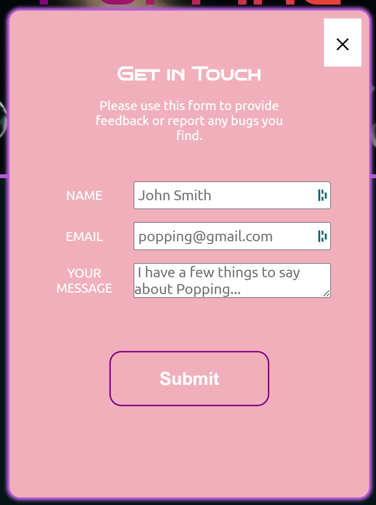
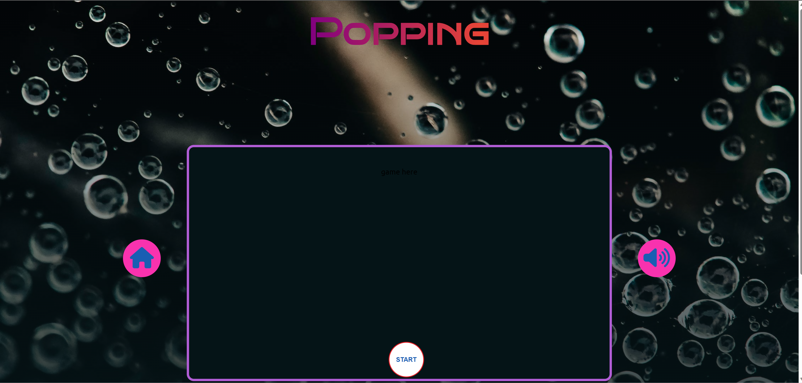

Milestone Project 2.

#  

## Live Project

[Click me for live link.]()

## Repository

[Click me for the project repository.]()

# Table of Contents

## Contents
- [User Experience](#user-experience)
  * [User Stories](#user-stories)
    + [Users](#users)
    + [Business Owner](#business-owner)
  + [Future Features](#future-features)
- [Design](#design)
  + [Overview](#overview)
  + [Color Scheme](#color-scheme)
  + [Typography](#typography)
  + [Wireframes](#wireframes)
- [Features](#features)
  + [All Pages Features](#all-pages-features)
- [Technologies used](#technologies-used)
  + [Languages Used](#languages-used)
  + [Frameworks Libraries and Programs](#frameworks-libraries-and-programs)
- [Deployment](#deployment)
  + [How To Fork](#how-to-fork)
  + [How To Clone](#how-to-clone)
- [Testing](#testing)
  + [W3C Validator](#w3c-validator)
  + [Lighthouse](#lighthouse)
- [Future Features](#future-features)
- [Credits](#credits)
  + [Code](#code)
  + [Content](#content)

# User Experience

## User Stories

### Users
- As a player, I want the website to load quickly and provide a enjoyable experience.

| **Feature** | **Action** | **Expected Result** | **Actual Result** |
|-------------|------------|---------------------|-------------------|
| Website Load | Player opens the website | The website loads quickly with no issues | [Works as expected](/) |

- As a player, I want to be able to visualize the contents of - Demo - so i can understand and interact with the game.

| **Feature** | **Action** | **Expected Result** | **Actual Result** |
|-------------|------------|---------------------|-------------------|
| Demo Button | Clicks demo button | Play button disappears, a video demonstration  shows with controls available  | [Works as expected](/) |

- As a player, I want to have different levels to choose from and  be able to select which I want to play.

| **Feature** | **Action** | **Expected Result** | **Actual Result** |
|-------------|------------|---------------------|-------------------|
| Level selected | Choose button level | Game starts according to level selected | Works as expected |

- As a player, I want to be able to check my progress during the game.

| **Feature** | **Action** | **Expected Result** | **Actual Result** |
|-------------|------------|---------------------|-------------------|
| Game Page | Game start - Mid Game - End Game  | Clear progress indication throughout the game  | [Works as expected](/) |

- As a player, I want to be able to easily navigate back to the home page after completing the quiz.

| **Feature** | **Action** | **Expected Result** | **Actual Result** |
|-------------|------------|---------------------|-------------------|
| Game ended | Game quiz completion | A congratulation message, along with the player score a play again button and a home button | [Works as expected](/) |

### Business Owner

- I want to be able to receive feedback from players regarding any issues, or comments about the game.

## Future Features 

- Include a timer, increasing the game interactivity and hopefully excitement, with scoring based on their speed and accuracy.

- I hope to implement a multiplayer scoreboard, along with players nicknames + pictures or icons.

-  Create a system of goals, where they may earn some sort of badges | inspiring messages or even a new item, icon they can use in game.

# Design

## Overview
The website consists of three pages home-page, level-page, game-page. The pages are structured in an easy-to-navigate with simple buttons indicating their function allowing visitors to quickly understand the game. The demo button provides a video showing a little demonstration of what the game is and how to play, the play button takes the player, to the levels page with three levels to choose from (easy, medium, hard), upon the player level selection, to the game.

## Color Scheme

  * The website uses a palette of colors generated using the [Coolors]("https://coolors.co/") website. 
  It uses a simple color scheme of Persian-pink and rose , Cherry-blossom and Amethyst with pops of dark-blue and red, along with the primary color.

## Typography

 Google Fonts was used for the following fonts:
  * Bruno Ace Sc : was used for the logo.
  * Ubuntu: was used for the headings, paragraphs and small texts.
  * Sans-serif: used as the fallback font.

## Wireframes

# Features

## All Pages Features

### Home-Page
 - This page shows an welcome message to the game, along with two button options: A Demo button and a Play button on a vibrant red. On the background, as an overlay it displays different bubbles from random colors.

 

 | **Demo-Page** | **Play Button** |
|-----------------------|------------|
| The Demo button once clicked, hides the play button and adds a video demonstration of how to play the game as well as navigate the page. | The Play button once clicked will take the user to the Levels page |

### Levels-Page
 - This page requests the user to select a game difficulty level. Displaying a container with three buttons, easy, medium, hard, each representing a game level. The page also displays a home and a sound button, in case the player wants to return to the home-page, or simply toggle the sound off.

 

| **Home-btn** | **Sound-btn** | **Easy - Medium - Hard buttons**|
|-----------------------|------------|--------------|
| Takes the player back the the previews page(Home-Page). | Pause or play the sound | Takes the player to the next page (game page, according to the difficulty level chosen) |
 
 The levels page also contains a footer containing social links and a feedback button which will open a modal allowing the player to send me an email message.  

 | **Footer** | **Modal** |
 |------------|-----------|
 |  |  |

 ### Game-Page
  - 

Before game start:
  

After game start:
  

# Known Bugs

# Technologies Used

## Languages Used

## Frameworks Libraries and Programs

# Deployment
Github Pages was used to deploy the live website. The instructions to achieve this are below:

1. Log in (or sign up) to Github.
2. Find the repository for this project, .
3. Click on the Settings link.
4. Click on the Pages link in the left hand side navigation bar.
5. In the Source section, choose main from the drop down select branch menu. Select docs/ from the drop down select folder menu.
6. Click Save. The live website site is now deployed at the URL showned at the top by Github pages.

#### How to Fork

Forks are used to propose changes to someone else's project or to use someone else's project as a starting point for your own idea. By forking the GitHub Repository you make a copy of the original repository on our GitHub account to view and/or make changes without affecting the original repository.
To fork the DragonFly repository:

1. Log in (or sign up) to Github.
2. Go to the repository for this project, .
3. Click the Fork button in the top right corner.
4. You should now have a copy of the original repository in your GitHub account.

#### How to Clone

To clone the DragonFly repository:

1. Log in (or sign up) to GitHub.
2. Go to the repository for this project, .
3. Click on the code button, select whether you would like to clone with HTTPS, SSH or GitHub CLI and copy the link shown.
4. Open the terminal in your code editor and change the current working directory to the location you want to use for the cloned directory.
5. Type 'git clone' into the terminal and then paste the link you copied in step 3. Press enter.

# Testing

### W3C Validator
 * Initial Testing

| **Overlay-Home-Page** | **Levels** | **Game** |
|-----------------------|------------|----------|
| [Home-Page](/docs/assets/images/readme/overlay-html.png) | [Levels](/docs/assets/images/readme/levels.html.png) | [Game-Page]() |

* Final Testing

| **Overlay-Home-Page** | **Levels** | **Game** |
|-----------------------|------------|----------|
| [Home-Page](/) | [Levels](/) | [Game-Page]() |

### Lighthouse

### Full Testing

# Credits

## Content
* Logo image: [Microsoft Bing](https://www.pngkey.com/png/full/1-19017_bubbles-png.png)
* Loading Gif: [tenor](https://tenor.com/en-GB/view/loading-load-circle-buffering-waiting-gif-15572297)
* Background image: [Pexels](https://www.pexels.com/photo/drops-of-water-3391752/)

## Code

* Logo Gradient: [Youtube](https://www.youtube.com/watch?v=f3mwKLXpOLk&list=PL4-IK0AVhVjMI45H5E9oE47wj-7AZLNnK)

Please note this is a personal project. This website is purely for the sake of the developer's portfolio and not for public consumption.

Thank You, for getting this far!

Esmael Pinho
2023